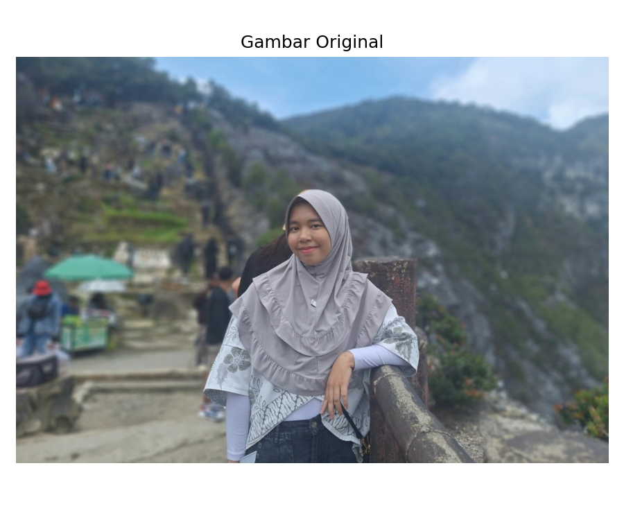
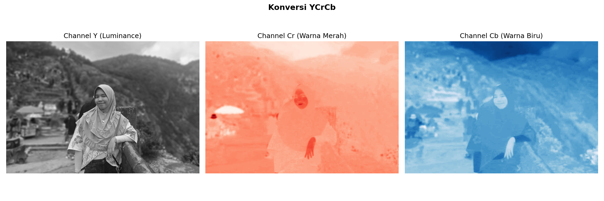
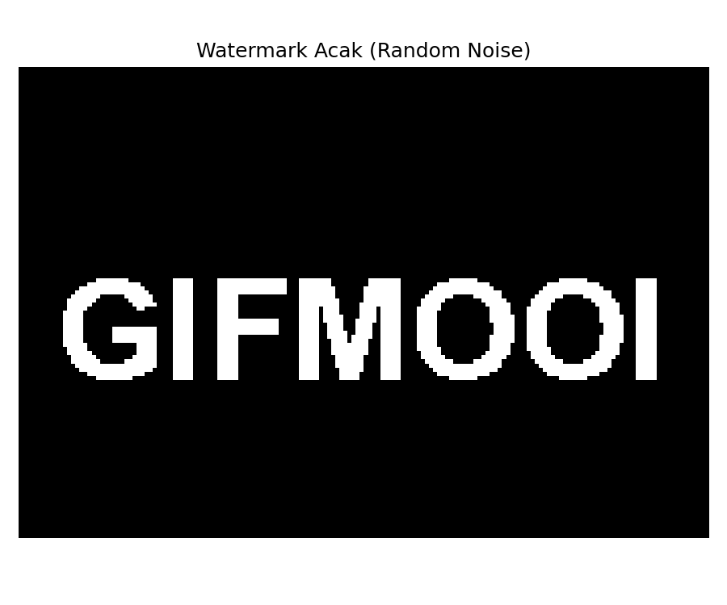
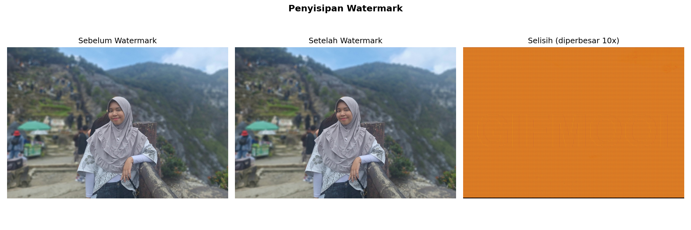
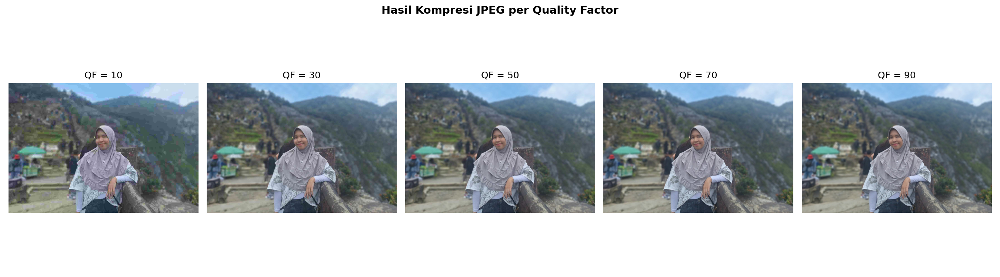
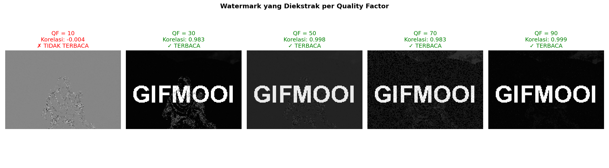
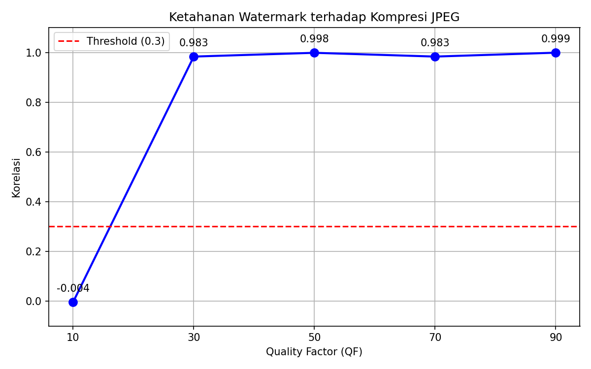
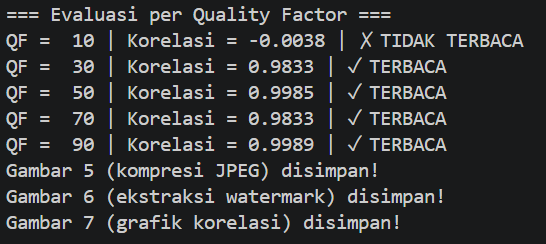

# Watermarking Citra Digital - Sistem Multimedia


## Deskripsi
Program ini mengimplementasikan *invisible watermarking* pada citra digital menggunakan metode DCT (*Discrete Cosine Transform*). Watermark berupa pola teks "GIFMOOI" yang disisipkan secara tak kasat mata ke dalam gambar. Ketahanan watermark kemudian dievaluasi terhadap kompresi JPEG dengan berbagai nilai *Quality Factor* (QF).

---

## Algoritma yang Digunakan
- **DCT (Discrete Cosine Transform)** — mengubah blok pixel ke domain frekuensi sehingga watermark dapat disisipkan ke koefisien frekuensi menengah tanpa mengubah tampilan visual gambar
- **YCrCb Color Space** — gambar dikonversi ke ruang warna YCrCb agar watermark hanya disisipkan ke channel Y (luminance/kecerahan), sehingga warna gambar tidak berubah

---

## Proses Watermarking

### 1. Gambar Original
Gambar wajah dibaca dalam format berwarna (BGR) menggunakan OpenCV.



---

### 2. Konversi YCrCb
Gambar dikonversi dari format BGR ke ruang warna YCrCb. Ruang warna ini memisahkan informasi kecerahan (channel Y) dari informasi warna (channel Cr dan Cb). Watermark hanya disisipkan ke channel Y agar tampilan warna gambar tidak berubah secara visual.



---

### 3. Pembuatan Watermark
Watermark dibuat dalam bentuk teks "GIFMOOI" berukuran sesuai jumlah blok 8x8 yang ada di gambar. Piksel putih bernilai 1 dan piksel hitam bernilai 0.



---

### 4. Penyisipan Watermark (Embed)
Channel Y dibagi menjadi blok-blok 8x8 pixel. Setiap blok ditransformasi menggunakan DCT, lalu bit watermark disisipkan ke 3 koefisien frekuensi menengah. Blok kemudian dikembalikan ke domain spasial menggunakan Inverse DCT. Gambar selisih (diperbesar) menunjukkan lokasi perubahan akibat penyisipan watermark — perubahannya sangat kecil sehingga tidak terlihat secara visual.



---

### 5. Kompresi JPEG
Gambar yang telah di-watermark dikompres menggunakan kompresi JPEG dengan 5 nilai Quality Factor (QF) yang berbeda. Semakin kecil nilai QF, semakin besar tingkat kompresi dan semakin banyak detail gambar yang hilang.



---

### 6. Ekstraksi Watermark
Dari setiap gambar yang telah dikompres, watermark diekstrak dengan membandingkan koefisien DCT gambar asli dan gambar yang dikompres. Terlihat bahwa pada QF = 10, watermark yang diekstrak hampir tidak terbaca (korelasi mendekati 0), sedangkan pada QF 30 ke atas watermark masih terbaca dengan baik (korelasi mendekati 1).



---

### 7. Evaluasi Ketahanan Watermark
Grafik berikut menunjukkan nilai korelasi antara watermark asli dan watermark yang diekstrak pada setiap nilai QF. Garis merah putus-putus adalah threshold 0.3 — di atas threshold berarti watermark masih terbaca, di bawah berarti tidak terbaca.



---

### 8. Output Terminal


---

## Kesimpulan
Watermark tidak dapat diekstrak pada **QF = 10** karena kompresi yang terlalu agresif merusak koefisien DCT tempat watermark disisipkan. Pada QF 30 ke atas, watermark masih dapat diekstrak dengan korelasi mendekati 1.0.

---

## Requirements
```
pip install numpy opencv-python scipy matplotlib pillow
```

## Cara Menjalankan
1. Letakkan file foto di folder yang sama dengan `main.py`
2. Sesuaikan nama file foto di `main.py` pada variabel `IMAGE_PATH`
3. Jalankan program:
```
python main.py
```
4. Hasil evaluasi akan tersimpan di folder `output/`